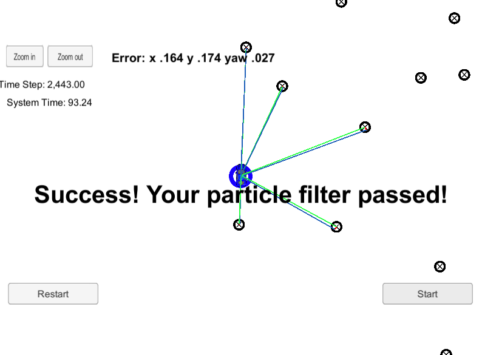

# Particle Filter Localization Project

In this project, I implemented particle filter approach for the 2D localization of the vehicle. 

# Input - Output

Initially, we are given a map of 2D landmarks and initial noisy GPS position. During the runtime, a special sensor can observe landmarks within a certain range and provide 2D locations of them in a local coordinate. We are also given vehicle velocity and yaw rate of the vehicle.

Each particle will have x, y, theta and weight attributions. Particle with the highest weight will be picked as a candidate.

# Pipeline

1. Initialize particles using initial x, y, theta and respective noise parameters. I decided to use 250 particles.
2. Prediction: I used biycle motion model with varying yaw rate and given sensor noise parameters.
3. Weight update: Used nearest neighbor approach for finding the closest landmarks and calculated projection error between map landmarks and observations. 
4. Resampling: 

# Discussion

Particle filter implementation was relatively straightforward however I ran into several issues during the development:
1. Sensor noise parameters are given in terms of range and bearing. However, we calculate projection error in terms of x and y axis difference. It was a bit tricky to convert x-y to range-bearing format and calculate weights using multivariate gaussian pdf.
2. Always be careful when dealing with divisions. Sometimes it is really hard to spot errors caused by div-by-zero.
3. Always make sure your program handles angle equivalence situations i.e. -pi/2 = (3/2)*pi
